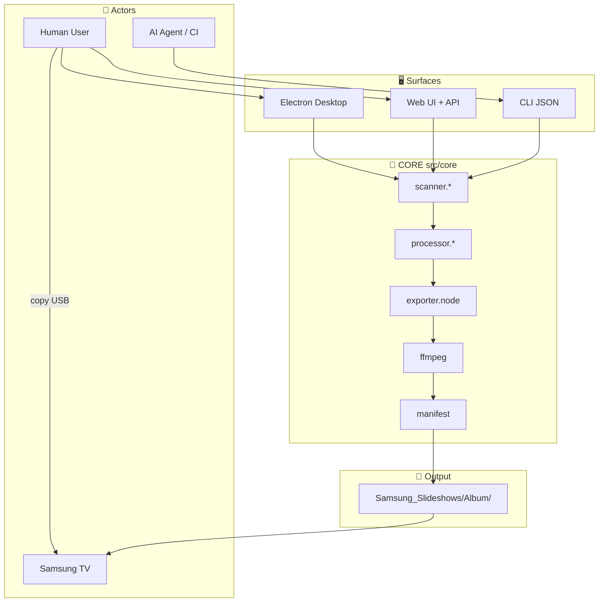
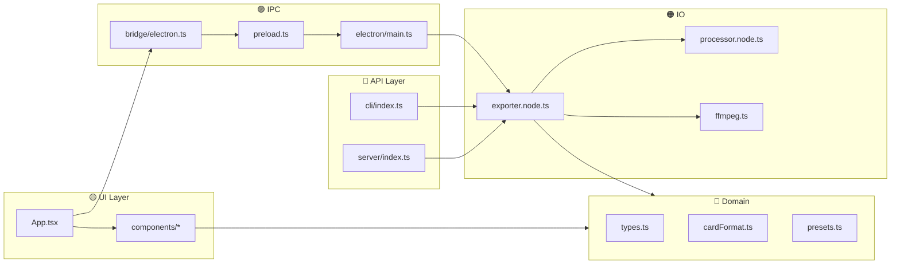
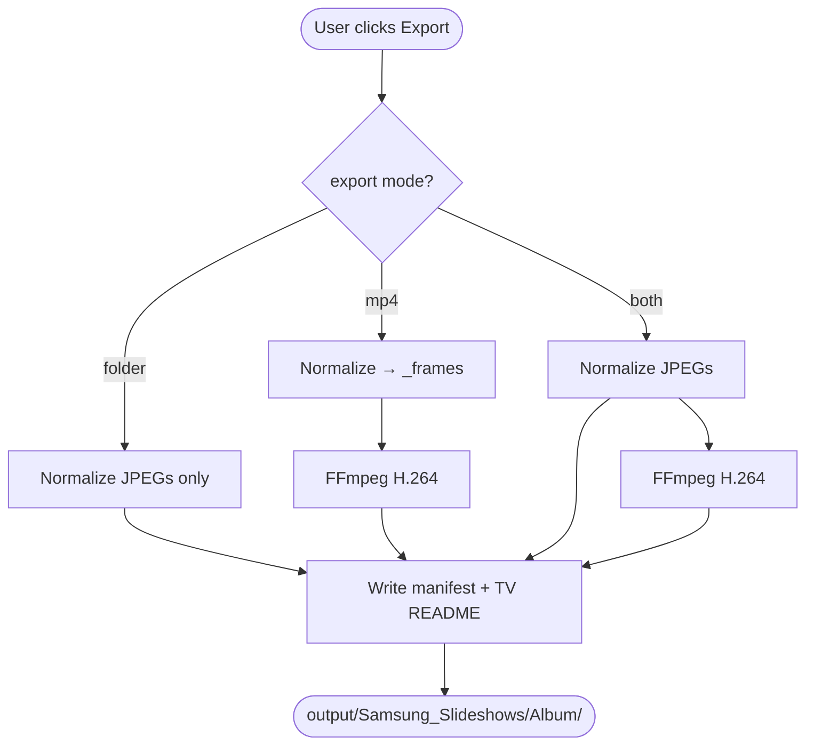
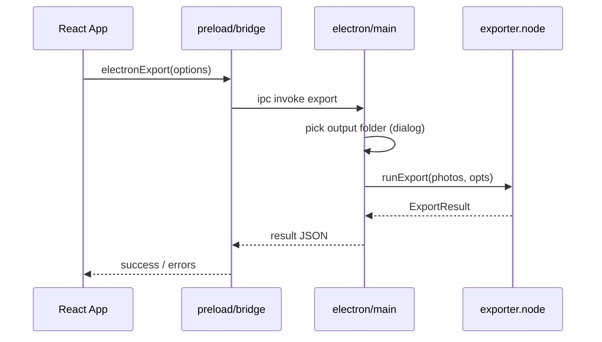
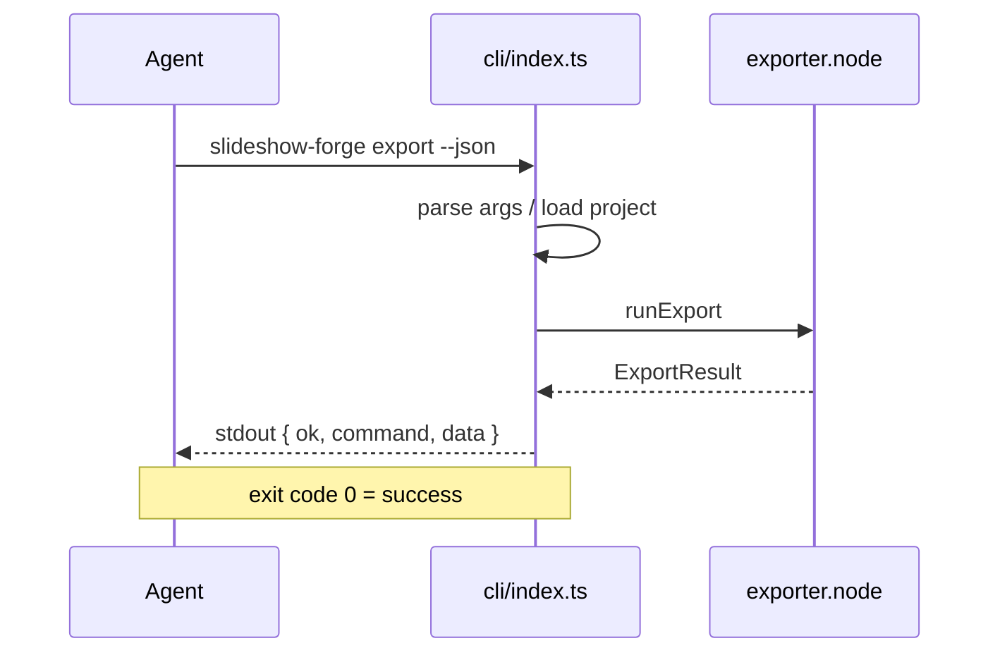
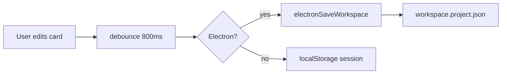
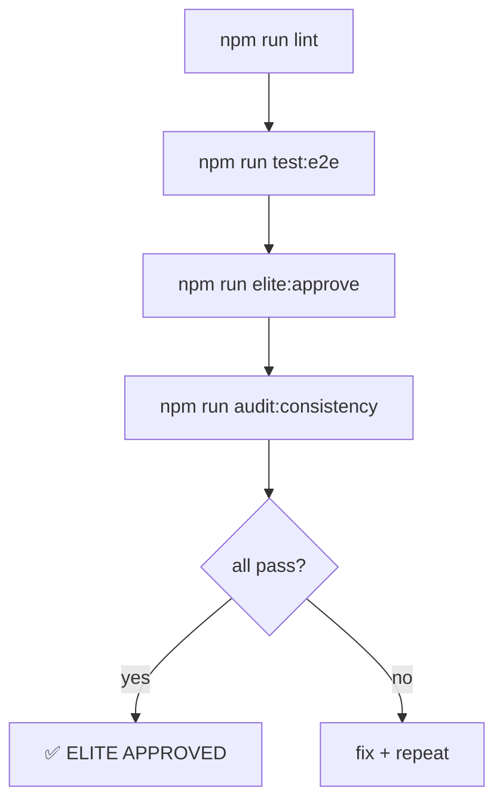

# 🔄 FLOW MAP — Slideshow Forge v3.0.0

> **Control & data flow** across layers. Pair with [E2E_MAP.md](./E2E_MAP.md).

| Meta | Value |
|------|-------|
| Tag | `[META]` Architecture |
| Diagrams | Mermaid (GitHub-renderable) |

---

## 1️⃣ System Context

---

## 2️⃣ Layer Responsibilities

**Rule:** UI never calls FFmpeg directly. All encode paths go through `[IO] exporter.node.ts`.

---

## 3️⃣ Export Decision Flow

---

## 4️⃣ Electron IPC Flow

**IPC channels:** workspace load/save, scan, export, pick folder, pick music, doctor.

---

## 5️⃣ CLI JSON Flow (AI agents)

---

## 6️⃣ Session / State Flow

| State | Web | Electron |
|-------|-----|----------|
| Photos order + card edits | `session.browser` | `workspace.project.json` |
| Settings | `storage.browser` | project file + IPC save |
| History | `storage.browser` | same |

---

## 7️⃣ Test / Gate Flow

---

## 🔗 References

- [docs/ARCHITECTURE_QUALITY_GUIDE.md](./docs/ARCHITECTURE_QUALITY_GUIDE.md)
- [docs/PIPELINE.md](./docs/PIPELINE.md)
- [electron/main.ts](./electron/main.ts)
- [src/core/exporter.node.ts](./src/core/exporter.node.ts)
